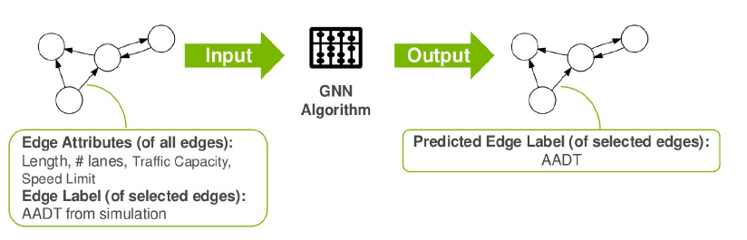

# Predicting Average Annual Daily Traffic (AADT) with Graph Neural Networks

Predicts Annual Average Daily Traffic (AADT) on the Chicago highway network using MLP, GCN, and Transformer models built in PyTorch. The pipeline replaces slow simulation workflows with a fast, scalable ML system that processes large, noisy data, encodes network structure via NetworkX, and tracks experiments in Weights & Biases (W&B). Achieved >3× validation MSE reduction (0.55 → 0.18) and matched traditional simulation accuracy with a Git-based, reproducible workflow adaptable to large and unseen networks.

Model Overview

### 🗺️ Highway Network Visualization

